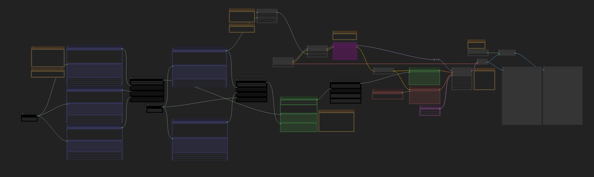
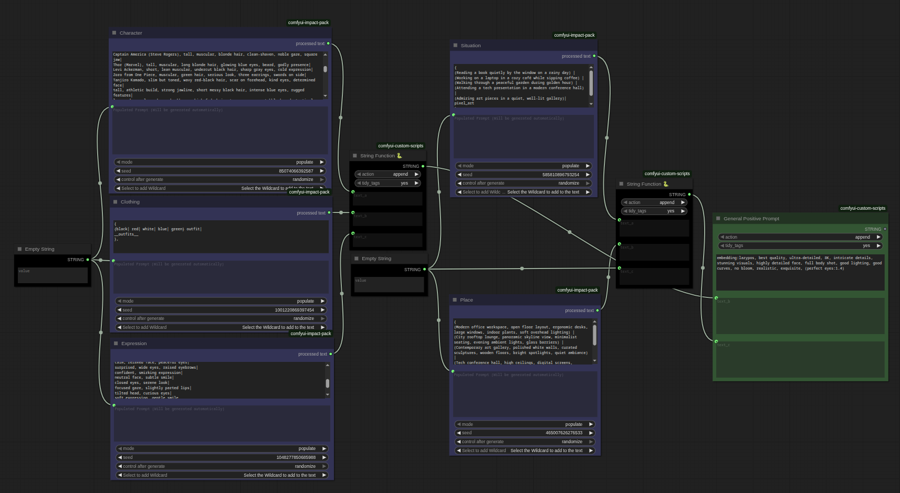
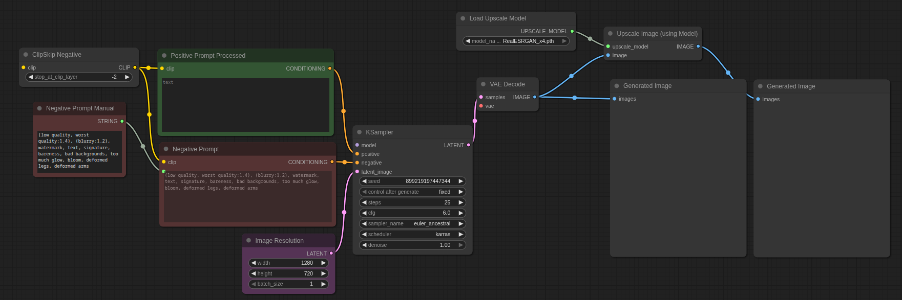
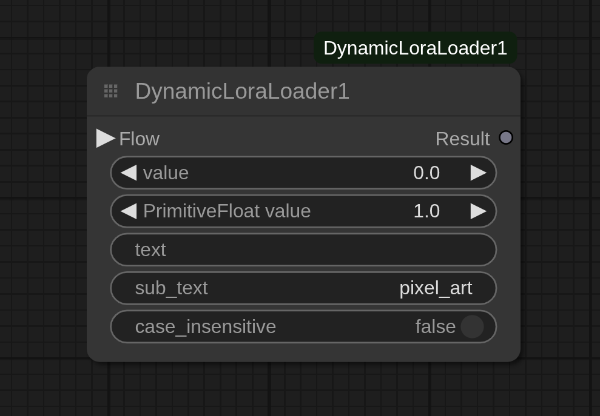

# 🔥 Image Generation Workflows

Welcome to **my collection of advanced workflows for image generation using ComfyUI** — designed for high-quality, realistic, and anime-style outputs with smart automation features.

---

## ✨ Features

* 🔀 Random Prompt Combination Generator

* 🔀 Dynamic LoRA Loader

* ⬆️ Upscale images up to **4x resolution**

* 📺 Supports high-resolution generation up to **1080p**

* 🧐 Realistic and consistent generations

* 🌺 Optimized sampler and model configurations for best results


## 🧠 IMPORTANT TIP !!

* **All Of The Nodes Are Color Coded For Easier Understanding:**
* **Orange** Color Boxes Are Your Special **Notes** To How Each Of The Nodes Work, Read Them If You Dont Know What To Do.

* **Do not Change Anything In The Black Color Nodes They Are Functional Nodes And Tinkering Will Not Do Anything Good**.
* All The **Purple** Nodes Are Your Wildcard Processors, Change Them To Customise The Different Variations.
* AlL The **Green** Nodes Are Realted To The Positive Prompt.
* All The **Red** Nodes Are Related To The Negative Prompt.
* The **Yellow** Color Coded Group Is Your Dynamic LoRA Loader.
* The **Magenta** Nodes Are Bypassed Nodes Select them And Press Ctrl+B To Activate Them Again.
* The **Pink** Node Is Your Latent Image Node Change It To Select The Batch Amount And Also The Image Resolution.
* The Upscaling Node And The Vae Decode Node Are Pretty Self Explanatory.

---

## 🖼️ Screenshots

> Below are sample screenshots of the workflows in action:



### 🧬 The Wilrcard Processor To Generate Random Or Customised Variations



### 🏞️ Realistic/Anime Image Generation Workflow



### 🖌️ Dynamic LoRA Loader:


---

## ⚙️ Requirements

* **Python 3.12** (Recommended)

### 🔼 Recommended Upscale Models

* 4x-AnimeSharp (for anime-style images)
* RealESRGAN\_x4plus (for general upscaling)
* 4x-UltraSharp  (for high detail enhancement)

---

## 📦 Custom Nodes (Place inside `ComfyUI/custom_nodes/`)

> All node-specific dependencies are mentioned in their respective repos/folders.
> ⚠️ **Use the same virtual environment (venv) or Python version that runs ComfyUI to avoid errors.**

* [ComfyUI Manager](https://github.com/Comfy-Org/ComfyUI-Manager.git)

  ```bash
  git clone https://github.com/Comfy-Org/ComfyUI-Manager.git custom_nodes/ComfyUI-Manager
  ```

* [ComfyUI Essentials](https://github.com/cubiq/ComfyUI_essentials.git)

  ```bash
  git clone https://github.com/cubiq/ComfyUI_essentials.git custom_nodes/ComfyUI_essentials
  ```

* [WAS Node Suite](https://github.com/WASasquatch/was-node-suite-comfyui.git)

  ```bash
  git clone https://github.com/WASasquatch/was-node-suite-comfyui.git custom_nodes/was-node-suite-comfyui
  ```

* [Flow Nodes](https://github.com/gitmylo/FlowNodes.git)

  ```bash
  git clone https://github.com/gitmylo/FlowNodes.git custom_nodes/FlowNodes
  ```

* ComfyUI-Custom-Scripts & ComfyUI-Impact-Pack From The ComfyUi-Manager

---

## ⚙️ Installation

* Just Drag And Drop **TheVariatedWorkflow.json** In Your Comfyui Graph.
* If Found Any Missing Nodes Just Install Them With Either The ComfyUI Manager Or The Link Given Above.


## 🧠 Resources

> For models, VAEs, LoRAs, Lycoris, embeddings, wildcards, and ControlNets:

* [civitai.com](https://civitai.com)
* [huggingface.co](https://huggingface.co)

---

## 🧪 Recommended Models per Workflow

* **🎨 Variated Anime Scene Generations**

  * Works best with: *Illustrious* or *Pony-based models* (Some SD1.5 models also perform well)

* **📸 Variated Realistic Generations**

  * Best with: *RealVisXL v5.0 Lightning (BakedVAE)* Or *Juggernaut XL* Or Any Other Well Trained Stable Diffusion Model
  * Advanced option: *Flux.1D* or *Flux.1S* (for experienced users) as it might need manual configurations and installations of the Flux libraries

---
